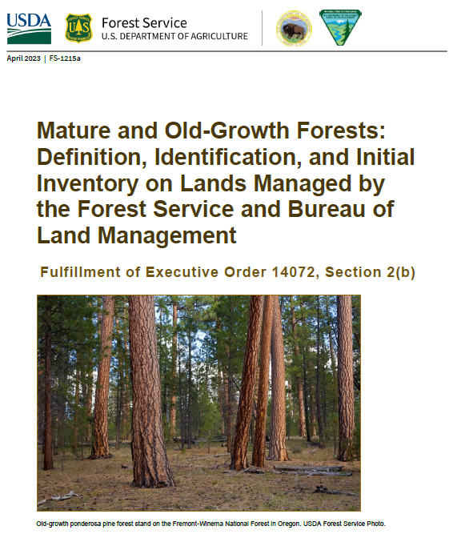

# Identify old growth forests

R function to determine old-growth status in eastern US forests. See pp. 45-46 in the [USDA report.](https://www.forestlandowners.com/wp-content/uploads/2023/04/mature-and-old-growth-forests-tech.pdf) 